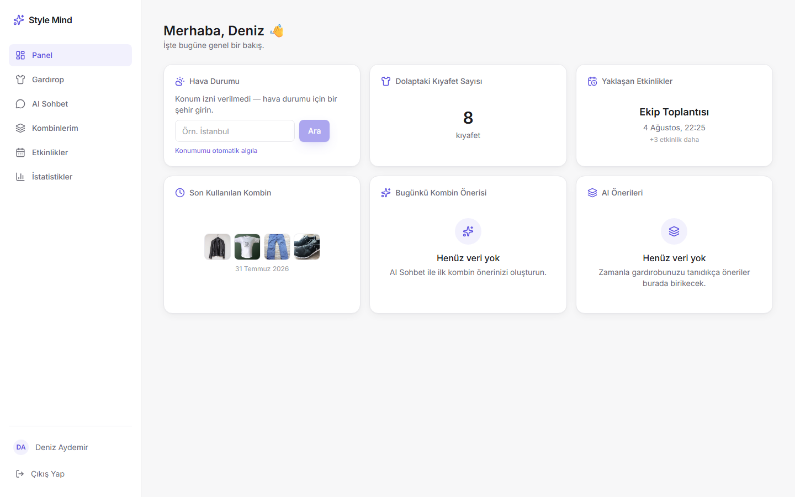
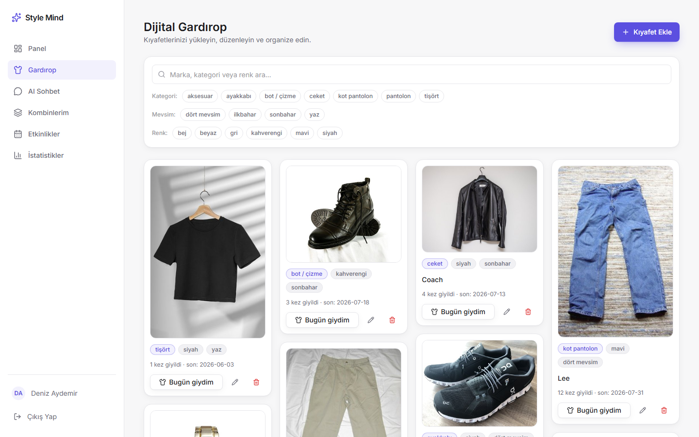
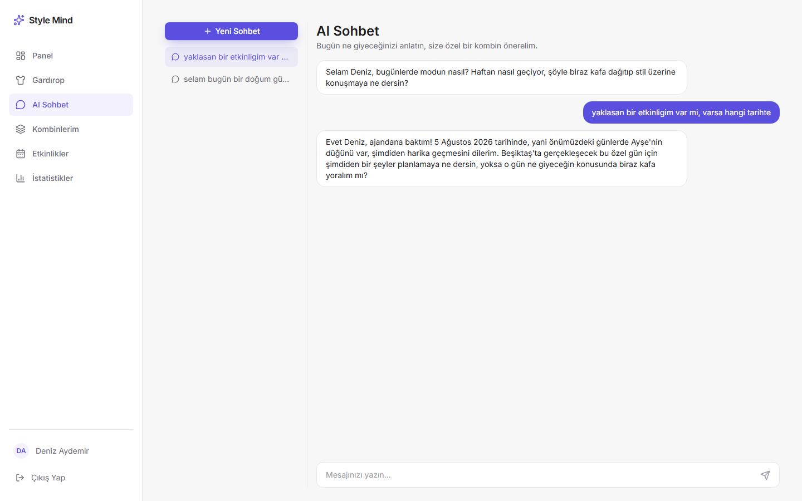
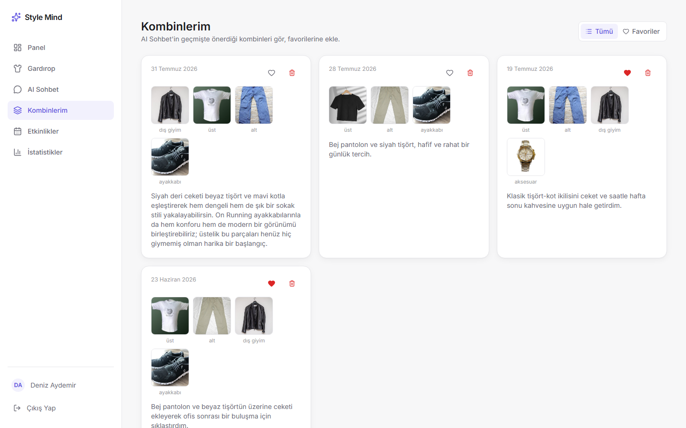
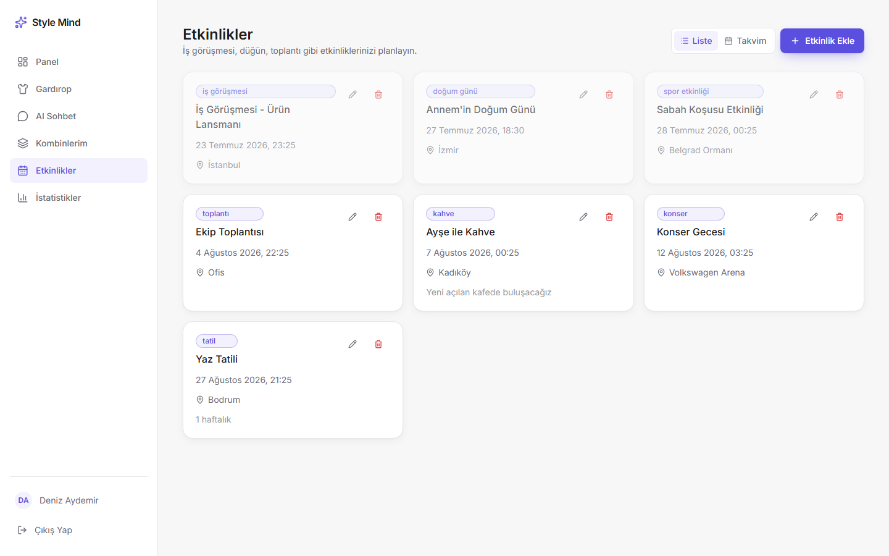
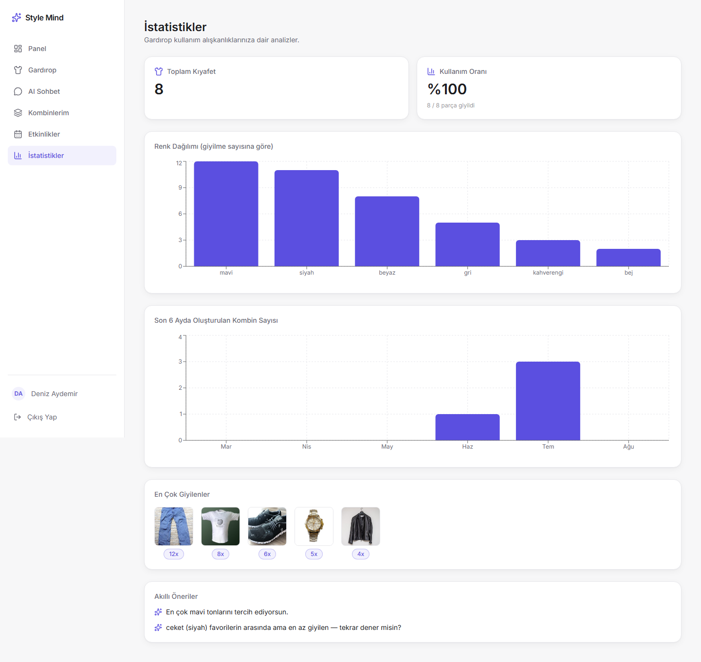
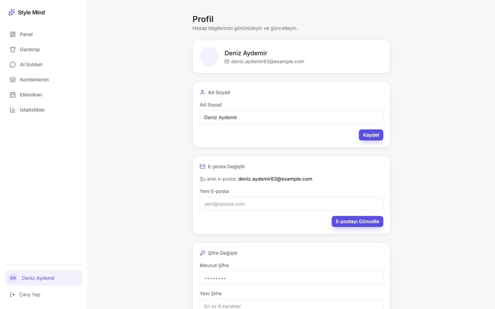

# **Takım İsmi**

StyleMind AI

# Ürün İle İlgili Bilgiler

## Takım Elemanları

- Enes Buğra Damar: Scrum Master
- Oğuzhan Ünal: Product Owner
- İrem Damla Dural: Developer
- Atakan Tatar: Developer
- Merve Yıldız: Developer

## Ürün İsmi

--StyleMind AI--

## Ürün Açıklaması

- StyleMind AI, yapay zekâ destekli bir sanal dolap ve sürdürülebilir stil platformudur. Kullanıcının kıyafetlerini fotoğraftan otomatik olarak etiketleyerek (kategori, renk, mevsim) dijital bir gardırop oluşturur ve doğal dil komutlarıyla ("Bugün yağmurlu, iş görüşmem var") anlık, bağlama özel kombin önerileri sunar. Uygulama; gerçek zamanlı hava durumu, yıkama ve hijyen takvimi ile renk uyumu kurallarını birleştirerek eğilimlere değil kullanıcının kendi dolabına odaklanan bütünleşik bir deneyim sağlar. "Her gün doğru kombini bulmak artık bir tıklama uzağınızda."

## Ürün Özellikleri

- Fotoğraftan otomatik kıyafet etiketleme (kategori, ana renk, mevsim tespiti)
- Doğal dil komutuyla bağlama özel kombin üretimi (AI Stilist)
- Gerçek zamanlı hava durumuna göre kombin önerisi
- Yıkama, hijyen ve son giyilme tarihi takibi
- Sürdürülebilirlik yönlendirmeleri (uzun süre kullanılmayan ürünler için sat/bağışla)
- Kişisel dolap analitiği (hangi kıyafet ne sıklıkla giyiliyor)
- Etkinlik planlama (iş görüşmesi, düğün, toplantı vb.) ve etkinliğe özel kombin hatırlatması
- Kombin geçmişi ve favoriler (AI Sohbet'in önerdiği kombinleri kaydetme, favorileme)

## Hedef Kitle

- 18-35 yaş üniversite öğrencileri ve şehirli genç profesyoneller
- Karar yorgunluğu yaşayan ve zaman kazanmak isteyen kullanıcılar
- Sürdürülebilir moda tutkunları
- Stil danışmanları ve içerik üreticileri
- Gardırobunu daha verimli kullanmak isteyen herkes

## Product Backlog URL

---

# Sprint 1

- **Sprint Notları**: Bu sprintte StyleMind AI'nin temel iskeletinin oluşturulmasına odaklanılmıştır. Sanal Dolap veri modelinin kurulması, kullanıcının kıyafet fotoğrafı yükleyebileceği ekranın prototiplenmesi ve etiketleme akışının temel yapısının hazırlanması hedeflenmiştir. Takım içi rol dağılımı ilk toplantıda netleştirilmiş ve iş yükü developer'lar arasında dengeli şekilde paylaştırılmıştır.

- **Sprint içinde tamamlanması tahmin edilen puan**: Toplam backlog puanının yaklaşık yarısı ilk iki sprinte, kalanı son sprinte dağıtılacak şekilde planlanmıştır. Sprint 1 için hedeflenen puan, sprint kapasitesini aşmayacak şekilde belirlenmiştir.

- **Puan Tamamlama Mantığı**: Backlog'umuz ilk yapılacak story'lere göre düzenlenmiştir. Sprint başına tahmin edilen puan sayısını geçmeyecek şekilde sıradan seçimler yapılmaktadır. Story başına çıkan tahmin puanı, toplam puanın yarısından az tutulmuştur.

  Story'ler yapılacak işlere (task'lere) bölünmüştür.

- **Daily Scrum**: Daily Scrum toplantılarının zamansal sebeplerden ötürü Slack üzerinden yapılmasına karar verilmiştir.

- **Sprint Review**:
Alınan kararlar: Sanal dolap için veritabanı şemasının (kullanıcı, kıyafet, etiket tabloları) oluşturulması Sprint 1 içinde gerekli görülmüştür. Fotoğraftan otomatik etiketleme modelinin (Swin Transformer / ResNet) entegrasyonunun bu sprintte tam kapsamıyla ele alınamayacağı görülmüş, ilgili PBI bir sonraki sprint'e aktarılmıştır. Yüklenen kıyafet fotoğraflarının görüntülenmesi ve manuel etiketlenmesi akışında bir problem görülmemiştir. Kombin önerisi ekranı için eklenmesi gereken ekstra özellikler belirlenmiştir. Sprint Review katılımcıları: Oğuzhan Ünal, Enes Buğra Damar, İrem Damla Dural, Atakan Tatar, Merve Yıldız.

- **Sprint Retrospective:**
  - Takım içindeki görev dağılımıyla ilgili düzenleme yapılması kararı alınmıştır.
  - Tahmin puanları gözden geçirilmeli ve sprint planlama toplantılarında gerekli geri bildirimlerin developer'lar tarafından verildiğine emin olunmalı.
  - Görüntü işleme modelinin entegrasyonu için ayrılan efor/saat bir sonraki sprintte artırılmalı.
  - Slack üzerinden yürütülen Daily Scrum'ların düzenliliği korunmalı.

---

# Sprint 2

- **Sprint Notları**: Bu sprintte StyleMind AI'nin temel yapısının geliştirilmesine ve fotoğraftan otomatik kıyafet tanıma özelliğinin uygulanmasına odaklanılmıştır. Sprint 1'de sayılan prototiplerin ileri seviyelere taşınması, yapay zeka destekli görsel analiz akışının gerçek projeye entegre edilmesi ve kombin önerisi algoritmasının temel mantığının kodlanması hedeflenmiştir. Takım, belirlenen görev dağılımında etkin şekilde ilerlemiş ve backend ile frontend arasında iletişim düzeni kurulmuştur.

- **Sprint içinde tamamlanması tahmin edilen puan**: Sprint 1'de alınan geri bildirimlere göre puan dağılımı yeniden düzenlenmiştir. Backlog'un kalan yarısı Sprint 2 ve Sprint 3'e dengeli şekilde paylaştırılmıştır. Sprint 2 için tahmin edilen puanlar, ekip kapasitesi ve önceki sprintteki çıktılar dikkate alınarak belirlenmiştir.

- **Puan Tamamlama Mantığı**: Backlog'daki story'ler önceliğe göre yeniden sıralanmıştır. Bağımlılıkları olan task'ler öncelikli olarak ele alınmıştır. Story'ler detaylı şekilde task'lere bölünmüş, her task için tahmin puanları tekrardan değerlendirilmiştir. AI entegrasyonuna yönelik task'ler daha ayrıntılı şekilde planlanmıştır.

- **Daily Scrum**: Slack üzerinden yürütülen Daily Scrum'lar düzenli olarak devam etmiştir. Takım üyeleri günlük ilerlemeleri, engelleri ve çıktıları paylaşmıştır.

- **Ürünün Durumu:** 
Ekran Görüntüleri:

- **Sprint Review**:
Alınan kararlar: Fotoğraftan otomatik kıyafet tanıma özelliği, Sprint 1'de planlanan Swin Transformer/ResNet yaklaşımı yerine **Gemini Vision API** kullanılarak hayata geçirilmiştir; kullanıcı kameradan bir kıyafet fotoğrafı yüklediğinde model fotoğrafı analiz edip otomatik bir açıklama (kategori + kıyafet tanımı) üretmektedir. Bu değişimin, sprint kapsamına daha hızlı ve daha az riskle sığdığı değerlendirilmiştir. Doğal dil komutuyla bağlama özel kombin üretimi (AI Stilist) özelliğinin temel altyapısı kurulmuş ve sohbet ekranı üzerinden uçtan uca çalışır hale getirilmiştir; model, öneriyi yalnızca kullanıcının dolabındaki gerçek eşyalarla sınırlandıracak şekilde yapılandırılmıştır. Metin olarak eklenen kıyafetler için otomatik görsel bulma ihtiyacı doğmuş, geçici bir çözüm olarak görsel arama entegrasyonu yapılmıştır; kalıcı ve daha güvenilir bir görsel kaynağının Sprint 3'te değerlendirilmesine karar verilmiştir. Gerçek zamanlı hava durumu entegrasyonu, yıkama/hijyen takibi ve kişisel dolap analitiği özelliklerinin bu sprintin kapsamına alınamayacağı görülmüş, bu PBI'ların Sprint 3'e aktarılmasına karar verilmiştir. Kullanıcı bazlı kimlik doğrulamanın henüz tam olarak kurulmadığı, bunun önümüzdeki sprintte netleştirilmesi gerektiği not edilmiştir. Sprint Review katılımcıları: Oğuzhan Ünal, Enes Buğra Damar, İrem Damla Dural, Atakan Tatar, Merve Yıldız.

- **Sprint Retrospective:**
  - AI entegrasyonuyla (görüntü analizi + kombin sohbeti) ilgili teknik zorluklar dokümante edilmiş ve çözüm yolları belirlenmiştir; bir sonraki sprint planlamasında AI ile ilgili story'lere daha gerçekçi puan verilmesi kararlaştırılmıştır.
  - Kullanıcı kimlik doğrulama story'sinin ertelenmesi, ileride teknik borç yaratmaması için Sprint 3'ün başına alınmalıdır.
  - Geçici çözüm olarak kullanılan görsel arama yönteminin kalıcı bir çözümle değiştirilmesi gerektiği not edilmiştir.
  - Frontend ve backend arasındaki API tasarımında iyileştirmeler yapılmalıdır.
  - Takım üyeleri arasında teknik bilgi paylaşımı artırılmalıdır.
  - Sprint 3 için gerçek zamanlı hava durumu entegrasyonu, sürdürülebilirlik yönlendirmeleri ve kullanıcı arayüzü geliştirmelerine ağırlık verilmelidir.

---

# Sprint 3

- **Sprint Notları**: Bu sprintte Sprint 2 Retrospective'te belirlenen hedefler doğrultusunda kullanıcı kimlik doğrulaması tamamlanmış (kayıt/giriş JWT ile), gerçek zamanlı hava durumu entegrasyonu (Open-Meteo, API key gerektirmez) ve dashboard eklenmiştir. Bunlara ek olarak backlog'da planlanan etkinlik planlama, kombin geçmişi/favoriler ve kişisel dolap analitiği (istatistikler) özellikleri de bu sprintte uçtan uca tamamlanarak canlıya alınmıştır. Profil sayfasına isim/e-posta/şifre güncelleme akışları eklenmiş, AI Stilist sohbetinin kullanıcının yaklaşan etkinliklerini de dikkate alacak şekilde genişletilmiştir.

- **Sprint içinde tamamlanması tahmin edilen puan**: Backlog'un kalan tamamı bu sprintte planlanmıştır. Sprint 2'de ertelenen kimlik doğrulama story'si sprint başına alınmış, kalan kapasite hava durumu, etkinlik planlama, kombin geçmişi ve istatistik story'leri arasında paylaştırılmıştır.

- **Puan Tamamlama Mantığı**: Sprint 2 Retrospective kararı gereği kimlik doğrulama story'si sprint başında tamamlanmış, ardından bağımlı olan diğer story'lere (hava durumuna göre kombin önerisi, etkinliğe özel hatırlatma gibi kullanıcıya bağlı özellikler) geçilmiştir. Story'ler task'lere bölünürken AI'a bağlı task'lere Sprint 2'deki geri bildirim doğrultusunda daha gerçekçi puanlar verilmiştir.

- **Daily Scrum**: Slack üzerinden yürütülen Daily Scrum'lar düzenli olarak devam etmiştir.

- **Ürünün Durumu:**
Ekran Görüntüleri:

- **Sprint Review**:
Alınan kararlar: Kullanıcı kimlik doğrulaması (JWT ile kayıt/giriş) tamamlanmış ve Sprint 2'den kalan teknik borç kapatılmıştır. Gerçek zamanlı hava durumu entegrasyonu Open-Meteo ile (API key gerektirmeden) hayata geçirilmiş, konum izni veya manuel şehir girişiyle çalışacak şekilde tasarlanmıştır. Backlog'da planlanan etkinlik planlama (iş görüşmesi, düğün, toplantı vb. etkinlik tipleri, liste/takvim görünümü), kombin geçmişi + favoriler (AI Sohbet'in önerdiği kombinlerin kaydedilip favorilenebilmesi) ve kişisel dolap analitiği (toplam kıyafet, kullanım oranı, renk dağılımı, en çok giyilenler, akıllı öneriler) özellikleri de bu sprintte tamamlanarak ürüne eklenmiştir. Profil sayfasına ad/soyad, e-posta ve şifre güncelleme formları eklenmiştir. AI Stilist, önerilerini artık kullanıcının yaklaşan etkinliklerini de dikkate alarak üretmektedir. Sprint Review katılımcıları: Oğuzhan Ünal, Enes Buğra Damar, İrem Damla Dural, Atakan Tatar, Merve Yıldız.

- **Sprint Retrospective:**
  - Tüm backlog kapsamının tek sprintte tamamlanması yüksek yoğunluk yaratmıştır; sonraki bir proje için puan dağılımının üç sprinte daha dengeli yapılması gerektiği not edilmiştir.
  - Kimlik doğrulamanın sprint başına alınması, sonrasındaki story'lerin akışını hızlandırmıştır — bağımlı story'lerin bir sonraki sprintin başına alınması iyi bir pratik olarak değerlendirilmiştir.
  - Ürünün veri taşınabilirliği (veritabanı ve yüklenen fotoğrafların `.gitignore` ile her kurulumda ayrı tutulması) gibi teknik kararların dokümante edilmesi gerektiği not edilmiştir.
